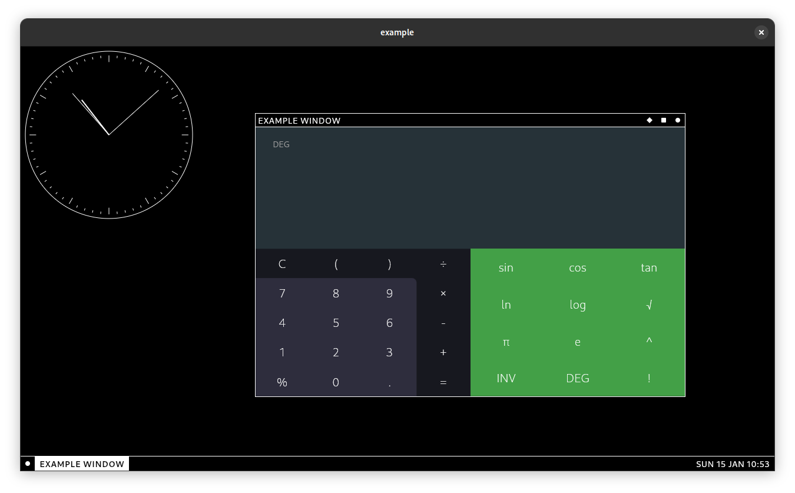

<a href="https://dahliaos.io">Website</a> •
<a href="https://dahliaos.io/discord">Discord</a> •
<a href="https://dahliaos.io/download">Releases</a> •
<a href="https://dahliaos.io/donate">Donate</a> •
<a href="https://docs.dahliaos.io">Documentation</a>

# Utopia Window Manager

 - **Utopia Window Manager** is made for the Pangolin DE
 - **Written** in Flutter

## Contribute

If you're wondering how to contribute to the project, please refer to [CONTRIBUTING.md](../CONTRIBUTING.md)

## License

  
  

Copyright @ 2019-2022 - The dahliaOS Authors - contact@dahliaos.io

This project is licensed under the [Apache 2.0 license](/LICENSE)
